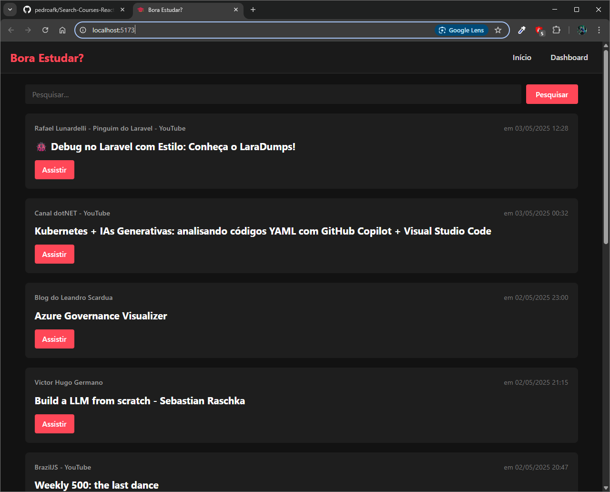
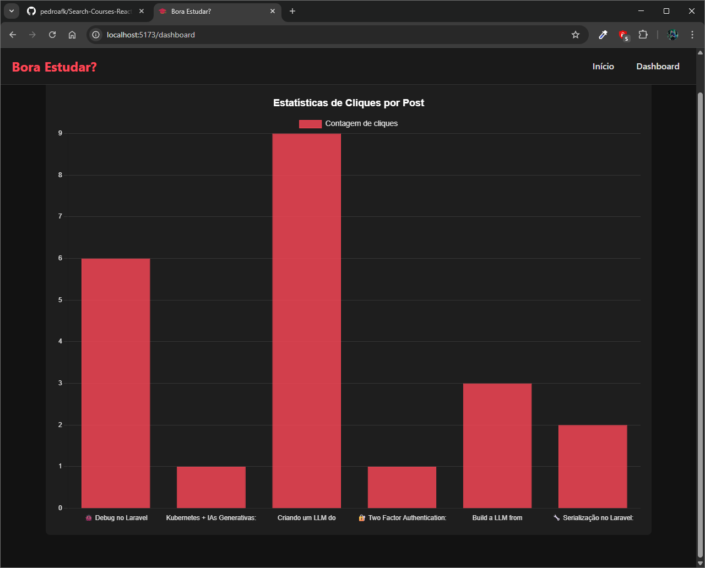

# Bora Estudar?

Este projeto é um Frontend React desenvolvido para o buscar cursos, com visualização de posts e estatísticas de cliques.

## Funcionalidades

- **Página Inicial**:
  - Listagem de posts com informações como título, site de origem e data de publicação
  - Sistema de busca por conteúdo
  - Registro de cliques nos links dos posts

- **Dashboard**:
  - Visualização gráfica (bar chart) das estatísticas de cliques por post
  - Design responsivo e adaptável

## Tecnologias Utilizadas

- React 19
- React Router DOM (v6) para navegação
- Chart.js e react-chartjs-2 para visualização de dados
- Axios para requisições HTTP
- Vite como build tool

---

## Como Executar

1. Certifique-se de ter o Node.js instalado (versão recomendada: 18+)
2. Instale as dependências:
   ```bash
   npm install
   ```
3. Inicie o servidor de desenvolvimento:
   ```bash
   npm run dev
   ```

## Requisitos do Backend

Este frontend espera que um backend esteja rodando em `http://localhost:8080` com as seguintes rotas:

- `GET /api/v2/post` - Listagem de posts
- `GET /api/v2/post?content={query}` - Busca de posts
- `GET /api/v2/post/{id}/click` - Registro de cliques
- `GET /api/v2/post/click/counts` - Estatísticas de cliques

---
## Telas do projeto

### Home

Essa tela é utilizada para ver todos os cursos disponíveis, além de permitir ao usuário pesquisar por algum curso na barra de pesquisa.



### Dashboard

Essa tela é utilizada para verificar a quantidade total de acessos que cada tópico obteve. Com isso, podemos destacar os cursos do melhor para o pior.


